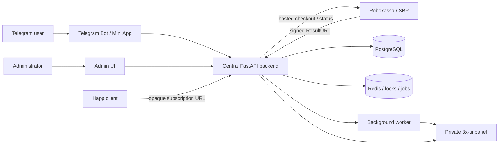

# System Architecture

## Goals

AGentVPN sells time-limited VPN access through a Telegram bot and Telegram Mini App.
An existing 3x-ui installation provisions two client bindings per paid subscription:

- Hysteria2 with TLS
- VLESS over TCP with REALITY

Both share URIs are delivered through one revocable HTTPS subscription compatible with
Happ.

## Context



## Trust Boundaries

1. **Public edge:** Telegram webhook, Mini App API, Robokassa ResultURL, and Happ subscription
   endpoint are internet-facing through the reverse proxy.
2. **Application network:** API, worker, PostgreSQL, and Redis communicate on a private
   container or host network.
3. **Provisioning boundary:** only API and worker may reach 3x-ui. The panel must be
   firewalled and allowlisted to backend addresses.
4. **Payment boundary:** only backend services hold Robokassa credentials and verify ResultURL.
5. **Admin boundary:** admin endpoints require explicit RBAC and audited elevated actions.

## Source Of Truth

PostgreSQL owns users, plans, payments, subscriptions, provisioning state, token state,
and audit history. 3x-ui is a provisioning engine, not the subscription database. Robokassa
is authoritative for provider-side payment state, while only a verified and matched
webhook may activate access.

## Backend Modules

```text
api/
  auth/             Telegram initData validation, sessions, CSRF
  users/            User lifecycle
  plans/            Sellable plans
  payments/         Provider abstraction, checkout, webhooks, reconciliation
  subscriptions/    Period calculation, activation, renewal, expiry
  provisioning/     Provider interface, orchestration, binding state machine
  happ/             Token lifecycle and public subscription rendering
  instructions/     Platform-specific official Happ instructions
  admin/            RBAC-protected operations
  audit/            Sanitized immutable audit events
  jobs/             Idempotent background task entry points
```

Business services depend on interfaces:

- `PaymentProvider`, implemented by `MockPaymentProvider` and `RobokassaPaymentProvider`
- `VpnProvisioningProvider`, implemented by `ThreeXUIProvisioningProvider`

All 3x-ui HTTP details remain inside the adapter. All Robokassa HTTP and signature details
remain inside the payment adapter.

## Core State Machines

### Payment

```text
created -> waiting -> success
                  -> failed
                  -> expired
success -> refunded
```

Only valid transitions are accepted. A unique provider event key and locked payment row
make duplicate webhook handling idempotent.

### Provisioning

```text
pending -> in_progress -> active
                       -> partial_failed -> retrying -> active
                                                   -> manual_review
active -> disabling -> disabled
```

A subscription is shown as fully active only after both required client bindings have
been verified in 3x-ui.

## Concurrency And Idempotency

- Payment webhook processing locks the payment row.
- Provisioning, renewal, expiry, and token rotation use transaction-scoped advisory locks
  keyed by subscription ID.
- Each binding uses stable external identity
  `tg_{telegram_id}_{subscription_id}_{protocol}`.
- Create operations first verify the inbound and existing client.
- Unsafe create operations are never blindly retried.

## Data And Secret Handling

- All application datetimes are UTC.
- Full subscription URLs, share URIs, credentials, initData, cookies, and secrets are
  redacted from logs.
- Only hashes of opaque Happ subscription tokens are persisted.
- Provider payloads are sanitized before storage.
- External request clients use explicit timeout, response-size, TLS, and redirect rules.

## Deployment Shape

The initial production deployment uses two Ubuntu 24.04 servers.

### AGentVPN Application Server

- 2 vCPU
- 4 GB RAM
- 1 Gbit/s network port
- reverse proxy
- API
- worker
- bot webhook handler
- PostgreSQL
- Redis
- Mini App static assets
- admin static assets

### Germany VPN Server

- 2 vCPU
- 4 GB RAM
- 1 Gbit/s network port with unlimited traffic
- existing 3x-ui installation
- Xray and Hysteria2 inbounds

Only the AGentVPN server's static public IP is allowed to reach the 3x-ui management API.
Users connect directly to the public VPN ports on the Germany server. The 3x-ui panel is
not publicly accessible.

Migrations run as a dedicated one-shot deployment task. PostgreSQL backups and 3x-ui
configuration backups are stored outside both production servers and tested through
restore drills.
